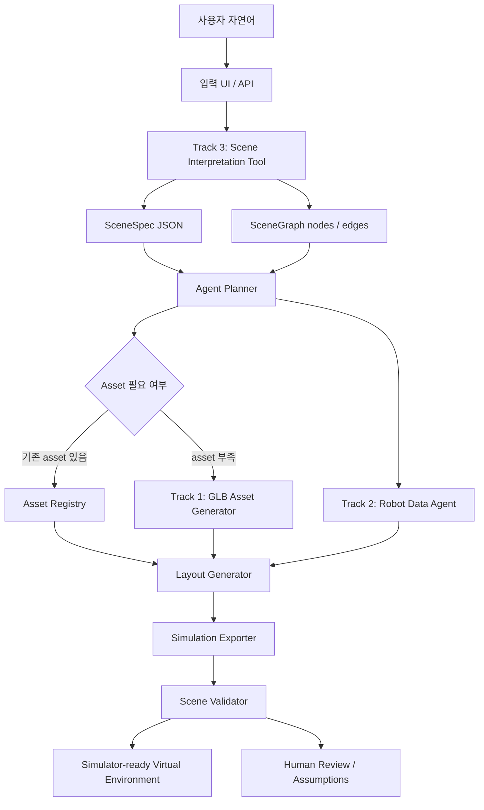

# TESSERACT Text-to-Simulation Architecture

이 문서는 `visionspace_assignment.pptx`를 기준으로 Track 1과 Track 3 구현을 하나의 Text-to-Simulation 시스템 안에 배치한 전체 아키텍처 설계입니다.

## 1. PPT 해석

과제 문서에서 중요한 신호는 다음과 같습니다.

| PPT 근거 | 해석 |
| --- | --- |
| Slide 2: L2 AI / Physics가 과제 초점 | 단순 웹 데모보다 Text-to-Simulation, LLM Agent, Scene Graph 설계 역량을 본다. |
| Slide 3: Track 3 필수, Track 1/2 선택 | Track 3는 공통 입력 해석 계층이고 Track 1/2는 downstream tool 후보이다. |
| Slide 4: Track 1은 산업 자산 GLB 생성 | Scene에 필요한 산업 asset을 생성/후처리하는 asset generation tool이다. |
| Slide 8: Track 3는 자연어를 JSON scene 명세로 변환 | Agent 또는 app의 입력을 simulator가 처리 가능한 중간 표현으로 바꾸는 scene interpretation layer이다. |
| Slide 8: Tool-calling / Function-calling, Scene Graph 언급 | 단순 문자열 파서가 아니라 schema-constrained tool contract와 graph 확장성을 보여야 한다. |
| Slide 11: LLM Agent/Tool 25%, 구조화 출력/Scene 20% | 전체 평가에서 agentic workflow와 scene representation 설계가 핵심이다. |

따라서 전체 목표는 다음과 같이 정의한다.

```text
사용자 자연어
  -> schema-constrained SceneSpec
  -> SceneGraph / asset requirements / constraints
  -> agent planner와 downstream tools
  -> simulator-ready virtual environment
  -> Physical AI 학습, 검증, synthetic data loop
```

## 2. 시스템 목표

최종 시스템은 자연어만으로 산업 자동화 시뮬레이션 환경을 구성하는 `Text-to-Simulation Agent`이다.

사용자는 다음처럼 말한다.

```text
AGV 6대를 700평 직사각형 공장에 격자 배치하고,
출입구 근처 2대는 회피 우선 모드로 설정해줘.
```

시스템은 이를 실행 가능한 중간 표현으로 변환한다.

```text
SceneSpec
  - 공간: factory, rectangle, 2314.05 m2
  - entity: 6 x AGV
  - placement: grid, near entrance
  - constraints: collision avoidance
  - required assets: agv
  - assumptions / warnings
  - scene graph nodes / edges
  - downstream task handoff
```

이 중간 표현은 특정 simulator에 종속되지 않는다. Unity, Unreal, Isaac, TESSERACT 내부 runtime으로 export할 수 있는 simulator-agnostic contract가 된다.

## 3. Layered Architecture

PPT의 TESSERACT 레이어를 기준으로 전체 구조를 잡는다.

```text
L4 Application
  - 데모 UI
  - 3D preview
  - scene JSON / graph / report
  - scenario comparison

L3 Simulation
  - layout generation
  - asset placement
  - Unity / Unreal / Isaac export
  - collision and scale validation

L2 AI / Physics
  - Text-to-Simulation Agent
  - Scene interpretation
  - Tool/function calling
  - Scene Graph
  - VLA / policy training interface

L1 Infrastructure
  - API server
  - job queue
  - model environments
  - asset storage
  - GPU runtime
```

이번 구현은 L2의 scene interpretation과 L3 협업 영역의 asset generation을 연결한다.

## 4. End-to-End Workflow



이 구조에서 Track 3와 Track 1의 관계는 다음과 같다.

```text
Track 3
  -> required_asset_types: ["agv", "conveyor", ...]
  -> downstream_tasks.asset_resolution
  -> missing_asset_queue

Track 1
  -> missing_asset_queue를 받아 reference image 기반 GLB 생성
  -> normalized GLB와 mesh metrics 반환
  -> Asset Registry에 등록
```

## 5. Core Modules

### 5.1 Scene Interpretation Tool

역할: 자연어를 downstream tool들이 사용할 수 있는 `SceneSpec`으로 변환한다.

현재 구현:

- module: `src/visionspace_asset_foundry/scene_interpreter.py`
- API: `POST /api/scene/parse`
- tool schema: `GET /api/scene/tool-schema`
- UI: `/track3`

Contract:

```text
parse_scene_to_scene_spec(user_instruction: str) -> SceneSpec
```

현재 runtime은 deterministic rule parser이다. 중요한 설계 포인트는 parser 자체가 아니라 parser 뒤의 contract다. LLM structured output, function-calling, repair/fallback runtime은 같은 `SceneSpec` contract 뒤에 붙일 수 있다.

### 5.2 Agent Planner

역할: `SceneSpec`과 `SceneGraph`를 읽고 다음 tool 호출 계획을 만든다.

주요 판단:

- 필요한 asset이 기존 registry에 있는가
- layout 생성에 필요한 공간 정보가 충분한가
- robot spec 또는 URDF가 필요한가
- simulator export 대상이 정해졌는가
- 모호한 입력은 default 처리할지 사용자에게 질문할지

현재 구현 범위:

- `downstream_tasks`로 계획 skeleton을 생성한다.
- 실제 LangGraph/ReAct planner는 향후 확장 지점으로 둔다.

### 5.3 Asset Resolution and Generation

역할: Scene에 필요한 asset을 찾고, 없으면 생성한다.

현재 구현:

- Track 1 UI: `/track1`
- API: `POST /api/generate`
- model runners: TripoSR, Hunyuan3D-2mini
- output: normalized GLB, mesh metrics

Pipeline:

```text
reference image
  -> model runner
  -> raw mesh / GLB
  -> GLB conversion
  -> scale normalization
  -> floor alignment
  -> mesh metrics
  -> AssetRecord
```

Track 1은 최종 Agent 안에서 독립 기능이 아니라 `missing_asset_queue`를 처리하는 downstream tool로 쓰인다.

### 5.4 Robot Data Agent

역할: 로봇/장비 metadata와 description file을 구조화한다.

PPT상 Track 2 영역이며 이번 구현 범위는 아니다. 하지만 전체 구조에서는 다음 정보를 공급해야 한다.

- URDF / MJCF
- link / joint graph
- payload, footprint, reach
- sensor, actuator, safety limit
- simulator import compatibility

이 정보는 layout, validation, simulator export에 필요하다.

### 5.5 Layout Generator

역할: 공간, entity, placement pattern, constraints를 실제 배치 계획으로 바꾼다.

Input:

- `SceneSpec.space`
- `SceneSpec.entities`
- `SceneGraphSpec`
- resolved assets
- robot spec

Output:

- positioned scene graph
- spawn plan
- scale and orientation metadata

아직 구현하지 않았지만, 현재 `SceneSpec`과 `SceneGraph`는 이 모듈을 붙일 수 있도록 설계되어 있다.

### 5.6 Simulation Exporter

역할: simulator-agnostic scene representation을 특정 runtime으로 변환한다.

대상:

- Unity
- Unreal
- Isaac Sim
- TESSERACT internal runtime

Output:

- scene config
- asset manifest
- transform list
- physics/collision settings
- validation report

### 5.7 Validator

역할: 생성된 scene이 학습/검증용으로 쓸 수 있는지 확인한다.

검증 항목:

- schema validity
- missing asset
- scale consistency
- collision policy
- placement feasibility
- robot reachability
- safety zone
- simulator export compatibility

## 6. Data Contracts

### 6.1 SceneSpec

`SceneSpec`는 전체 workflow의 핵심 중간 표현이다.

```text
SceneSpec
  version
  source_text
  space
  entities
  global_constraints
  required_asset_types
  scene_graph
  downstream_tasks
  tool_call
  assumptions
  warnings
```

설계 의도:

- 자연어의 모호성을 실행 가능한 구조로 고정한다.
- Pydantic으로 validation한다.
- downstream tool들이 같은 schema를 신뢰하고 소비한다.
- edge case는 숨기지 않고 assumptions/warnings로 보존한다.

### 6.2 SceneGraphSpec

`SceneGraphSpec`는 BDDL 또는 simulator scene graph로 확장하기 위한 graph 표현이다.

```text
nodes
  - space:main
  - entity:agv:0
  - zone:entrance
  - constraint:collision_avoidance

edges
  - entity:agv:0 -> space:main : placed_in
  - entity:agv:0 -> zone:entrance : near
  - entity:agv:0 -> constraint:collision_avoidance : governed_by
```

### 6.3 AssetRecord

`AssetRecord`는 Track 1 결과물의 표준 표현이다.

```text
AssetRecord
  id
  asset_type
  model
  source_image
  raw_path
  glb_path
  normalized_path
  metrics
  normalized_metrics
```

### 6.4 DownstreamTaskSpec

`DownstreamTaskSpec`는 planner가 다음 tool을 호출하기 전 필요한 handoff 상태를 표현한다.

```text
asset_resolution
layout_generation
simulation_export
scene_validation
```

각 task는 `ready`, `needs_confirmation`, `blocked` 상태를 가진다.

## 7. Agentic Tool Flow

최종 Agent는 다음 tool들을 orchestration한다.

```text
parse_scene_to_scene_spec
  input: user_instruction
  output: SceneSpec

resolve_assets
  input: required_asset_types
  output: resolved_assets, missing_asset_queue

generate_asset_glb
  input: asset_type, reference_image, prompt
  output: AssetRecord

query_robot_spec
  input: robot_name or robot_type
  output: RobotSpec, URDF/MJCF graph

generate_layout
  input: SceneSpec, SceneGraphSpec, resolved_assets
  output: positioned_scene_graph, spawn_plan

export_simulation_scene
  input: positioned_scene_graph, target_runtime
  output: simulator_scene_config

validate_scene
  input: scene_config
  output: validation_report
```

현재 제출물은 `parse_scene_to_scene_spec`와 `generate_asset_glb`를 구현하고, 나머지는 명확한 extension point로 둔다.

## 8. Current Implementation Scope

| 영역 | 구현 상태 | 설명 |
| --- | --- | --- |
| Track 3 Scene Interpretation | 구현 | 자연어 -> SceneSpec, SceneGraph, downstream tasks |
| Track 3 Schema Validation | 구현 | Pydantic 기반 validation |
| Track 3 Tool Contract | 구현 | `/api/scene/tool-schema` |
| Track 3 UI | 구현 | Function contract, graph, handoff plan 표시 |
| Track 1 Model Runners | 구현 | TripoSR, Hunyuan3D-2mini |
| Track 1 Postprocess | 구현 | GLB conversion, scale normalization, floor alignment, metrics |
| Track 1 UI | 구현 | image upload, model selection, GLB preview, job status |
| Track 2 Robot Data Agent | 미구현 | 전체 architecture의 extension point |
| Layout Generator | 미구현 | SceneSpec 기반 다음 단계 |
| Simulation Exporter | 미구현 | Unity/Unreal/Isaac export extension |
| Validator | 일부 skeleton | downstream task로 정의, 실제 validator는 향후 구현 |

## 9. UI Architecture

PPT 9페이지의 UI guide를 기준으로 다음 원칙을 적용한다.

- 색상: navy `#0F2D5C`, amber `#D97706`, white background, charcoal text
- 타이포: bold header, regular body, muted caption, mono code
- 레이아웃: card-based, 충분한 여백, 2~3 column grid
- 컴포넌트: status badge, 단순 버튼, 명확한 label
- 장식: 최소화하고 industrial dashboard 톤 유지

페이지 구성:

```text
/
  - Track 1 / Track 3 overview

/track1
  - 산업 자산 GLB 생성
  - 모델 상태
  - GLB preview
  - mesh metrics
  - generation jobs

/track3
  - 자연어 입력
  - function contract
  - SceneSpec JSON
  - SceneGraph
  - downstream handoff plan
  - evaluation mapping
```

## 10. Failure and Ambiguity Strategy

자연어 입력은 항상 불완전할 수 있다. 따라서 실패를 숨기지 않고 구조화해서 다음 단계로 전달한다.

| 상황 | 처리 |
| --- | --- |
| 수량 누락 | default를 적용하고 `assumptions`에 기록 |
| 공간 면적 누락 | layout task를 `needs_confirmation`으로 표시 |
| 공간 형태 누락 | rectangular default 후보를 `assumptions`에 기록 |
| entity 미검출 | `warnings`에 기록하고 layout/export를 block |
| asset 없음 | `missing_asset_queue`로 Track 1에 전달 |
| robot spec 없음 | Robot Data Agent tool 호출 필요 |
| export target 없음 | simulator-agnostic representation 유지 |

이 방식은 “모호한 명령 / 결측 파라미터 default 처리” 평가 항목과 직접 연결된다.

## 11. Evaluation Mapping

| 평가 항목 | 설계 대응 |
| --- | --- |
| LLM Agent / Tool | Track 3를 callable tool contract로 설계하고 downstream handoff를 생성 |
| 구조화 출력 / Scene | SceneSpec, SceneGraphSpec, DownstreamTaskSpec으로 중간 표현 고정 |
| 도메인 적응 | AGV, robot arm, conveyor, rack, worker, charging station과 산업 배치/제약 반영 |
| 평가 메트릭 | Track 1 mesh metrics, latency, face count, normalization 결과 기록 |
| 회고 / 의사결정 | deterministic baseline, LLM structured output 확장, image-to-3D 한계 명시 |

## 12. Roadmap to Final Submission

최종 제출 전 보강 우선순위는 다음과 같다.

1. Track 1 GLB 샘플 5개 확보
2. 모델별 latency, face count, file size, 실패 유형 비교표 작성
3. 실패 케이스 5개 분석 작성
4. Track 3 케이스별 SceneSpec / SceneGraph 예시를 REPORT에 요약
5. `SceneSpec.required_asset_types -> Track 1 generation queue` 연결을 문서와 UI에서 명확히 표시
6. 2분 데모 영상 흐름을 `Track 3 -> Track 1 -> GLB preview` 순서로 구성

## 13. Key Design Decisions

### Hybrid parser runtime

Track 3는 현재 OpenAI structured output을 우선 사용하고, 실패 시 deterministic parser로 fallback한다. 이유는 과제의 핵심인 schema 설계, edge case 처리, downstream contract를 유지하면서도 자연어 해석 품질을 실제 LLM 수준으로 끌어올리기 위해서다.

### SceneSpec contract stays provider-agnostic

`SceneSpec` contract와 `/api/scene/tool-schema`를 먼저 고정한 구조는 그대로 유지한다. 따라서 현재는 OpenAI structured output을 쓰더라도 이후 Claude tool use, local LLM JSON mode, rule-only parser를 같은 interface 뒤에 계속 연결할 수 있다.

### SceneSpec is simulator-agnostic

Unity, Unreal, Isaac 중 하나에 먼저 종속되면 과제 범위가 좁아진다. 따라서 현재는 simulator export 전 단계의 canonical representation을 설계했다.

### Track 1 is downstream, not separate

Track 1은 독립 GLB demo가 아니라 Agent가 필요한 asset을 확보하기 위해 호출하는 downstream generation tool로 배치했다.

### Human review is part of the loop

Physical AI 학습 환경은 잘못된 scene이 downstream으로 흘러가면 비용이 크다. 따라서 assumptions, warnings, validation status를 UI와 JSON에 노출한다.
